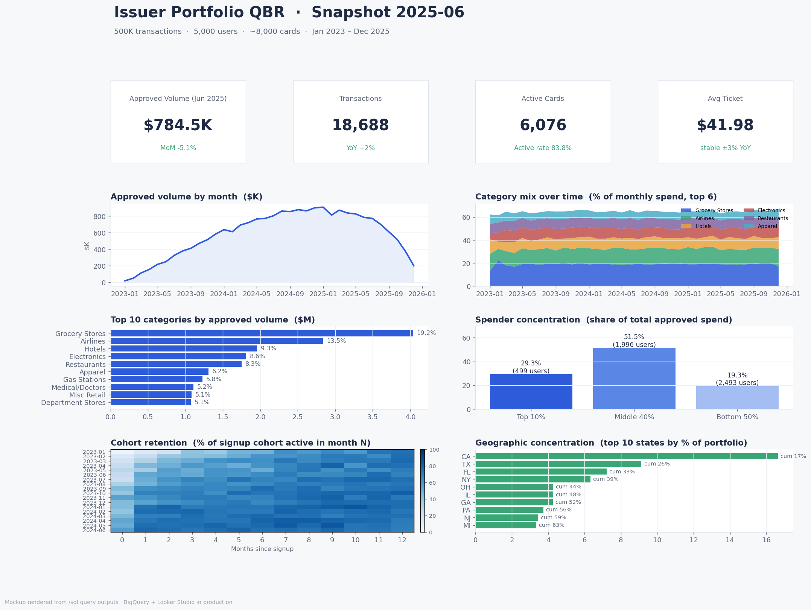

# Credit Card Transactions Analytics — Issuer QBR Simulation

> A SQL + dashboard project simulating the analytics an analyst on a
> financial institution partnership team would deliver in a Quarterly
> Business Review (QBR) for a card-issuing bank. Built to showcase the
> SQL, KPI design, and storytelling skills needed for FinTech / payments
> analyst roles.



## Overview

The project takes an issuer's transaction-level data and turns it into
a single read-out an account team can walk into a partner meeting with:
how is the portfolio growing, where is spend concentrated, which users
matter most, and what risks are worth flagging. The four query themes
(portfolio health, merchant/category insights, customer behavior, risk
& operations) match the structure of a real-world issuer QBR deck.

## Tech Stack

- **SQL / Warehouse:** Google BigQuery (free tier) — partitioned and
  clustered tables to stay under scan quotas
- **Dashboard:** Looker Studio (custom queries -> 6-section dashboard)
- **Data prep:** Python 3 + pandas
- **Local testing:** DuckDB — the same SQL runs locally so every query
  in `/sql` is regression-tested against real numbers before pushing
- **Source control:** Git / GitHub

## Data

- **Source:** IBM Synthetic Credit Card Transactions (Kaggle).
- **Fallback:** [`python/generate_data.py`](python/generate_data.py)
  produces a **schema-identical synthetic dataset** when the Kaggle
  download isn't available — 500K transactions, 5K users, ~8K cards,
  36 months. The findings in this repo were generated against that
  synthetic dataset; swapping in the real Kaggle file requires no
  query changes.
- **Schema:** `transactions(user_id, card_id, year, month, day, time,
  amount, use_chip, merchant_name, merchant_city, merchant_state, zip,
  mcc, errors, is_fraud)` plus `users` and `cards` tables.
- See [`data/README.md`](data/README.md) for download/load notes.

## Repo Structure

```
credit-card-analytics/
├── sql/                Analysis queries grouped by QBR theme (15 total)
├── python/             Data generation, cleaning, BigQuery + DuckDB loaders
├── data/               Raw + processed CSVs (raw gitignored)
├── dashboards/         Looker Studio build guide + PNG mockup
└── docs/               Findings writeup + methodology
```

## KPIs Tracked

Grouped to mirror a real issuer QBR deck:

- **Portfolio Health** — monthly volume, active card rate, avg ticket,
  MoM / YoY growth ([`sql/01_portfolio_health.sql`](sql/01_portfolio_health.sql))
- **Merchant & Category** — top categories, mix shift, avg ticket by
  MCC, top merchants in #1 category ([`sql/02_merchant_category.sql`](sql/02_merchant_category.sql))
- **Customer Behavior** — cohort retention, spender concentration,
  multi-card usage, per-active-user engagement ([`sql/03_customer_behavior.sql`](sql/03_customer_behavior.sql))
- **Risk & Ops** — decline rate by category and time, fraud rate by
  category and channel, geographic concentration ([`sql/04_risk_operations.sql`](sql/04_risk_operations.sql))

## Key Findings

Full writeup with numbers and recommended next steps:
**[`docs/findings.md`](docs/findings.md)**. Headlines:

1. Volume more than doubled YoY in 2024 (+161%) before plateauing in 2025.
2. Active-card rate is drifting down (95% -> 89%) — growth is becoming
   acquisition-led rather than activation-led.
3. Grocery is #1 at 19% of spend; Airlines + Hotels combined are 23%.
4. Top 10% of users drive 29% of volume; bottom 50% drive 19%.
5. Multi-card users spend ~5x what single-card users spend.
6. Top-5-state concentration is 48% — within tolerance but watch FL.
7. Fraud rate in high-ticket categories is ~4x everyday spend.
8. Per-active-user engagement is flat — growth is base-expansion, not
   deeper usage.

## Dashboard

- **Live link:** *(Looker Studio public URL goes here after publish)*
- **Build guide:** [`dashboards/BUILD_GUIDE.md`](dashboards/BUILD_GUIDE.md)
  — tile-by-tile config with the SQL file feeding each chart.
- **Mockup:** [`dashboards/mockup.png`](dashboards/mockup.png) — rendered
  from real query outputs.

## How to Reproduce

```bash
# 1. clone + venv
git clone <this repo> && cd credit-card-analytics
python3 -m venv .venv && source .venv/bin/activate
pip install -r requirements.txt

# 2. get data
#    real:       python python/download_kaggle.py
#    synthetic:  python python/generate_data.py    # 500K rows, ~10s

# 3. clean + load to local DuckDB warehouse
python python/clean_and_load.py

# 4. run every SQL file and save outputs to data/processed/query_outputs/
python python/run_queries.py

# 5. render the dashboard mockup PNG
python python/build_mockup.py
```

Loading to BigQuery instead of DuckDB:

```bash
export GCP_PROJECT=your-gcp-project
export BQ_DATASET=credit_card_analytics
# create the dataset + tables once
bq query --use_legacy_sql=false < sql/00_create_tables.sql
python python/load_to_bigquery.py
```

## What I'd Do Next

- **Layer in interchange revenue** at the MCC level so the team can
  rank categories by contribution margin, not just gross volume.
- **Build a churn-risk model** on the top decile of spenders
  (multi-card, drop in monthly transactions, category drift) and route
  flagged users to retention.
- **Connect to dbt** — turn the four SQL files into a small dbt project
  with tests on row counts, primary-key uniqueness, and KPI drift.
- **Add a decline-reason classifier** — group raw `errors` strings into
  ~6 actionable buckets (auth, network, balance, fraud-rule) so the ops
  team can prioritize fixes.

## Methodology

See [`docs/methodology.md`](docs/methodology.md) for KPI definitions,
sampling approach, and the BigQuery / DuckDB dialect notes used so the
same SQL file runs against both engines.

